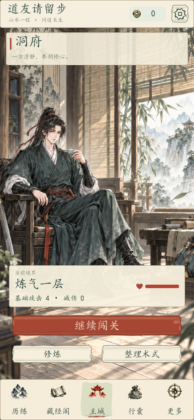
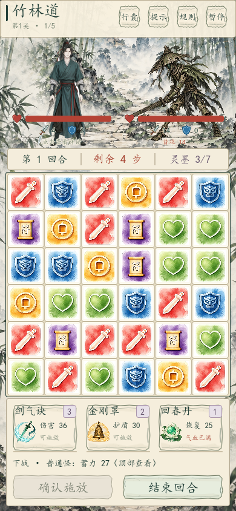
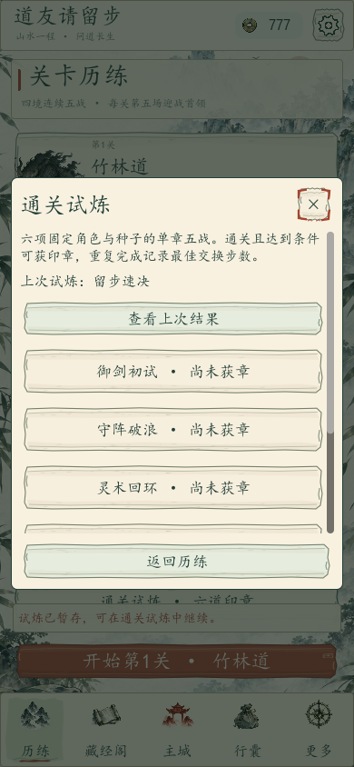

# 道友请留步 · 水墨仙途

水墨三消与卡牌策略单机游戏。本仓库的 Godot 原生工程位于 [`godot-ink/`](godot-ink/)，当前源码为 **1.5.0 通关试炼版**，使用 GDScript、Control 与 Tween。

四境各有连续五战，第五战为首领；三种修炼倾向、三式组合与六项固定种子试炼提供不同打法。界面沿用宣纸、朱砂与青墨风格。

| 洞府 | 连续五战 | 通关试炼 |
| --- | --- | --- |
|  |  |  |

## 下载游玩

| 版本 | 更新 | 下载 |
| --- | --- | --- |
| 1.3.0 策略流派版 | 敌人行动序列、术式联动、推荐配装、事件教学与战斗复盘 | [Release](https://github.com/lushuiqing1/daoyou-qing-liubu/releases/tag/godot-v1.3.0) |
| 1.4.0 修炼分支版 | 御剑、守阵、灵术三种倾向与三阶成长 | [Release](https://github.com/lushuiqing1/daoyou-qing-liubu/releases/tag/godot-v1.4.0) |
| 1.5.0 通关试炼版 | 六项固定角色、固定种子的五战试炼，印章与最佳交换记录 | [Release](https://github.com/lushuiqing1/daoyou-qing-liubu/releases/tag/godot-v1.5.0) |

在对应 Release 的 **Assets** 下载手动附加的 **Windows ZIP**，完整解压后双击包内 `启动游戏.cmd`，无需安装 Godot。保留 EXE、PCK 及其他文件在原目录。操作：相邻点击或拖动交换；1–3 选式，Enter 施放，E 结束回合，H 提示，Esc 暂停。

开发与历史版本请下载对应的手动附加 **源码 ZIP**。GitHub 自动生成的 `Source code (zip/tar.gz)` 是标签所指的仓库快照，不等同于这些完整源码交付包；当前仓库工程为 1.5.0。

## 导入源码

使用已验证的 **Godot 4.7.2**，在项目管理器选择“导入”，打开 `godot-ink/project.godot`，等待资源导入后按 F6 或 F5 运行。手动源码 ZIP 则导入解压目录中的 `project.godot`。

Windows 也可将 Godot 可执行文件路径作为第一个参数传入工程内的 `启动游戏.cmd` 或 `打开工程.cmd`。命令行示例（在仓库根目录执行，替换引擎路径）：

```powershell
& "C:\path\to\Godot_v4.7.2-stable_win64.exe" --headless --editor --path ".\godot-ink" --import --quit
& "C:\path\to\Godot_v4.7.2-stable_win64.exe" --path ".\godot-ink"
```

工程包含 `assets/`、`scripts/`、`data/`、`scenes/`、`tests/` 与 `docs/`。仓库源码省略缓存、构建文件、验证产物和实际玩家存档；完整交付与验证归档保存在各版本的手动源码 ZIP。素材来源与引擎许可见 `godot-ink/assets/sources/`，试炼重放见 [`TRIAL-REPLAYS.md`](godot-ink/docs/TRIAL-REPLAYS.md)。

已验证平台为 Windows / OpenGL Compatibility；手机尺寸画面来自 Windows 窗口模拟，尚无 Android APK 或 iOS 版本。字体使用设备系统字体。原网页版本的发布记录继续保留。